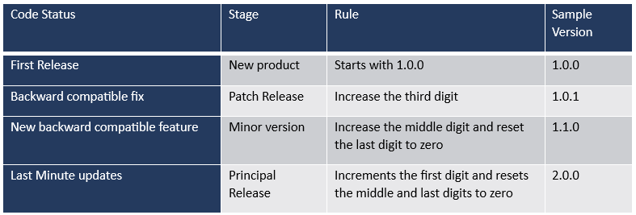

# Flujo de Desarrollo GitHub

Este documento detalla las buenas prácticas y recomendaciones para la gestión del ciclo de desarrollo, uso de ramas, pull requests, etiquetado, squash commits y ciclos de releases utilizando GitHub.

---

## 🔄 Ciclo General de Desarrollo

El flujo ideal comprende las siguientes ramas principales:

- `version`: rama congelada con la release etiquetada, habrá tantas como alcances o entregas se hayan realizado. La última versión entregada refleja el estado actual del producto en producción.
- `main`: rama principal de desarrollo que integra continuamente nuevas funcionalidades y correcciones.
- `nombre-de-la-tarea`: ramas individuales creadas por cada tarea o característica específica.

---

## 🌿 Ramas y Pull Requests por tarea

Cada tarea o ticket deberá tener su propia rama y su propia Pull Request.
Al finalizar la tarea , la rama se limpia, es decir será eliminada trás el mergeo de la Pull Request sobre la rama principal.
Las ramas tienen el ciclo de vida asociada a una tarea, de reabrirse la rama s epuede crear nuevamente hasta nueva Pull Request.
> **Nota:**
> No se puede hacer uso de ramas para varias tareas, estó generá problemas para 
 mantener asociada la tarea en la documentación, se pierde la trazabilidad de los cambios y puede generar conflictos en el código. 

**Proceso recomendado usando Visual Studio Code:**

1. Desde VS Code, selecciona la rama `main` y asegúrate de actualizarla con los últimos cambios.
2. Crea una nueva rama desde `main` usando la interfaz gráfica de VS Code.
3. Realiza commits locales frecuentemente desde la interfaz de control de versiones en VS Code.
4. Antes de abrir un Pull Request, sincroniza tu rama con la última versión de `main` haciendo "Rebase" desde VS Code.

---

## 📝 Pull Request y Etiquetado

Cada Pull Request debe:

- Tener un título descriptivo relacionado con la tarea en inglés.
- Estar etiquetado claramente:
  - Ejemplos de etiquetas comunes:
    - `bug`, `feature`, `hotfix`, `documentation`
- Estar vinculado a un issue o tarea específica.
- Requerir revisión y aprobación antes de integrarse a la rama `main`.

---

## 🔀 Squash Commits

Para mantener un historial claro y ordenado, se utilizará siempre **Squash and Merge**  para integrar los Pull Requests.

Esto:

- Simplifica el historial de commits en la rama `main`.
- Facilita la identificación de cambios importantes.
- Mantiene una buena trazabilidad.

---

## 🚀 Ciclo de Release Automático

Las releases serán generadas automáticamente mediante GitHub Actions al hacer un merge hacia la rama `main`.

- Al integrarse un Pull Request hacia la rama `main`, se activará automáticamente una GitHub Action.
- Esta GitHub Action generará automáticamente una versión (tag) y publicará la release asociada con un conjunto predefinido de acciones (tests, despliegue automático, etc.).
- Las etiquetas de versión seguirán un esquema semántico (vX.X.X) de manera automática.

---

## 📌 Buenas prácticas adicionales

- Crea Pull Requests específicos para facilitar la revisión.
- Comunica claramente cualquier cambio en el flujo o proceso.
- Documenta todos los cambios importantes.

**@Almena**